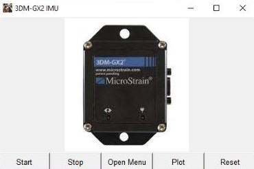
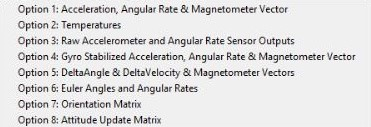

# MicroStrain 3DM-GX2 IMU Driver (Python)

This repository provides a Python-based driver for the [MicroStrain 3DM-GX2](https://www.microstrain.com/) Inertial Measurement Unit (IMU), including both **GUI** and **headless (terminal)** modes for real-time data acquisition, visualization, and basic alerting logic.

## 🧠 Features

- 📡 Serial communication with the 3DM-GX2 via USB  
- 🎛️ GUI interface for selecting and plotting different sensor modes  
- 🧮 Headless version for embedded use (e.g., Raspberry Pi)  
- 📊 Real-time plotting with low-pass filtering  
- ⚙️ Options for acceleration, gyroscope, magnetometer, temperature, orientation, and more  
- 🔔 Optional fall detection / door detection logic  
- 📁 Data logging to local `.txt` files  

---

## 🖥️ GUI Preview

### Main Interface



> Use the interface to start/stop data streaming, choose measurement mode, and visualize sensor data.

### Measurement Options



Measurement modes:

1. **Acceleration, Angular Rate & Magnetometer Vector**  
2. **Temperatures**  
3. **Raw Accelerometer and Angular Rate Sensor Outputs**  
4. **Gyro Stabilized Acceleration, Angular Rate & Magnetometer Vector**  
5. **DeltaAngle & DeltaVelocity & Magnetometer Vectors**  
6. **Euler Angles and Angular Rates**  
7. **Orientation Matrix**  
8. **Attitude Update Matrix**  

---

## ⚙️ Usage

### 🖥 GUI Version

```bash
python imu_gui.py
```

Use the GUI to start/stop, select data mode, and plot data.

### 🧱 Headless Mode (No GUI)

```bash
python imu_data.py
```

Modify the `choice = "optX"` line in the script to set your desired mode.

---

## 🚨 Embedded Use Cases

- **Fall Detection:** Detect sudden changes in angular velocity (e.g., from a falling shower head)  
- **Door Opening Detection:** Monitor magnetic vector changes to detect motion in smart home setups  
- **Body Movement Detection:** Combine with radar input for elderly monitoring systems  

---

## 📜 License

This project is licensed under the MIT License.  
You can add a license using the GitHub UI or by including a LICENSE file.

---

## 🧠 Credits

Developed for academic & prototyping purposes using the MicroStrain 3DM-GX2 sensor.  

If this helps you, feel free to ⭐ the repo!